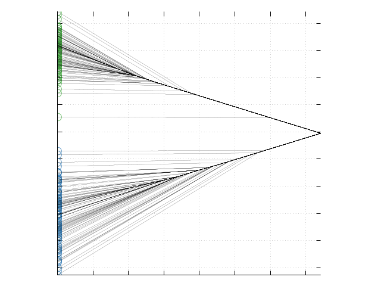
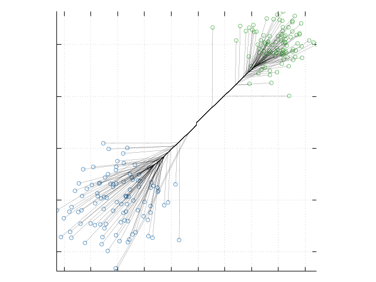
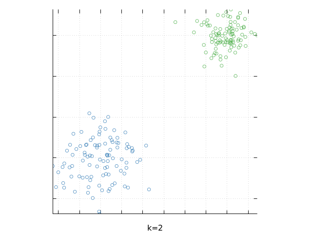

# Clusterpath.jl

Julia implementation of $\ell_1$ Clusterpath, described in the paper[^1]. 

## installation
```julia
import Pkg
Pkg.add("https://github.com/naturale0/Clusterpath.jl")
```

## Quick Start

### Sample procedure (with Big Merge Tracker)
* `generate_mixture_normal()`
  * generate `n` observations from mixture of univariate normals each with standard deviation $1$ and mean parameters `m` and proportion `p`.

```julia
Random.seed!(0)
x1 = generate_mixture_normal(1000, [-4.5, 4.5], [0.35, 0.65])
```

* `clusterpath()`
  * inputs:
    - `x`: observation vector 
    - `alpha`: Big Merge Tracker threshold
    
```julia
cc = clusterpath(x1, α=0., return_split=true)["splits"][end]
```

    -1.3447486506416237

* Another toy data

```julia
N = 100
Random.seed!(1)
xx = [randn(N, 2) .* .5; (randn(N, 2) .* 0.3 .+ 3)]
gt = repeat([1, 2], inner=N);
```

* `plot_path()`
  * plot clusterpath with the data(`x`) and the solution path casted by `cast_solution()`.
  * If the dimension of `x` is greater than 4, only plot combinations of first four dimensions.  
  ***`Gaston.jl` and `gnuplot` should be installed and on the PATH of your system. Install gnuplot [here](https://sourceforge.net/projects/gnuplot/files/gnuplot/).***
  * `x`: data
  * `solution`: solution path dataframe from `cast_solution()`
  * `gt`: ground truth labels
  * `savefig`: whether to save the figure as a PNG file. (default: `false`)
  * `fname`: image file name to be used when `savefig` is `true`. (default: `"path_plot"`)
  * `show`: whether to show the plot in the notebook. **Highly recommended not to show if the number of samples is large.** (default: `true`)

```julia
plot_path(xx[:, 1], α=0., gt=gt, show=true)
```




```julia
plot_path(xx; α=0., gt=gt, show=true)
```




* `plot_cluster()` 
  * Plots the scatter plot of the data `x` colored according to the cluster assigned by clusterpath algorithm.
  * If the dimension of `x` is greater than 2, perform PCA and plot two PCs.  
  ***`Gaston.jl` and `gnuplot` should be installed and on the PATH of your system. Install gnuplot [here](https://sourceforge.net/projects/gnuplot/files/gnuplot/). ***
  * `x`: data
  * `α`: threshold for BMT-clusterpath
  * `n_node`: if greater than `1`, will assign clusters from previous merge status. (default: `1`)
  * `show`: whether to show the figure.
  * `savefig`: whether to save the figure as a png file. (default: `false`)
  * `fname`: file name to save if `savefig` is true. (default: `"plot_clst"`)
  * `verbose`: print out current iteration. (default: `false`)


```julia
plot_cluster(xx, α=0.2; show=true, savefig=false)
```




* `assign_clusters()`
  * assign cluster to each of the observations in `x`.
  * returns an array of length=size(x, 1) of cluster indices.
  * `x`: data
  * `α`: threshold for BMT-clusterpath
  * `n_node`: if greater than `1`, will assign clusters from previous merge status. (default: `1`)

```julia
assign_cluster(xx, α=.2)'
```

    1×200 Adjoint{Int64,Array{Int64,1}}:
     1  1  1  1  1  1  1  1  1  1  1  1  1  …  2  2  2  2  2  2  2  2  2  2  2  2


### Population Procedure


```julia
include("PopulationSplit.jl");
```

* `cond_mean_on_LR()`
  * Conditional mean on $(L, R)$, defined as $\mu_{L,R} = \big(\int_L^R f(x) dx\big)^{-1} \cdot \int_L^R x f(x) dx$

* `find_split()`
  * Find a split point if `find_split=true`, or $\delta_1, \delta_2$ for truncation point searching if `find_deltas=true`.

* `find_truncation()`
  * Find the population split points.

* `clusterpath_pop()`
  * population-equivalent version of sample `clusterpath()` procedure.

```julia
splits = Array{Float64, 1}()
Lstars = Array{Float64, 1}()
Rstars = Array{Float64, 1}()

for p=0.5:0.05:0.9
    cp = clusterpath_pop(p, 4.5)
    push!(splits, cp["s"])
    push!(Lstars, cp["L*"])
    push!(Rstars, cp["R*"])
end

println([round(s, digits=2) for s in splits]')
println([round(l, digits=2) for l in Lstars]')
println([round(r, digits=2) for r in Rstars]')
```

    [0.0 -0.45 -0.9 -1.36 -1.82 -2.31 -2.89 -3.82 NaN]
    [-8.98 -8.54 -8.09 -7.63 -7.17 -6.67 -6.09 -5.18 NaN]
    [8.98 9.44 9.89 10.34 10.79 11.24 11.7 12.17 NaN]


```julia
splits = Array{Float64, 1}()

for p=0.5:0.05:0.9
    push!(splits, clusterpath_pop(p, 4.5)["s"])
end

splits'
```


    1×9 Adjoint{Float64,Array{Float64,1}}:
     0.0  -0.4495  -0.9005  -1.355  -1.8195  -2.314  -2.8935  -3.816  NaN


: exactly the same results as in the paper (supp. p.29 Table 1).


---

[^1]: Radchenko, P. and Mukherjee, G. (2017), Convex clustering via l1 fusion penalization. J. R. Stat. Soc. B, 79: 1527-1546. https://doi.org/10.1111/rssb.12226
